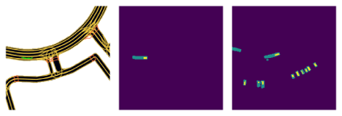
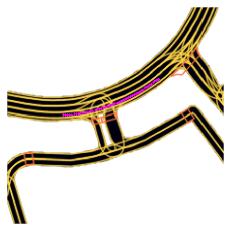
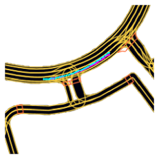
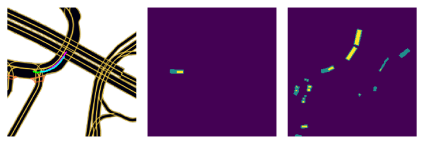
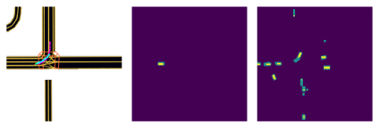
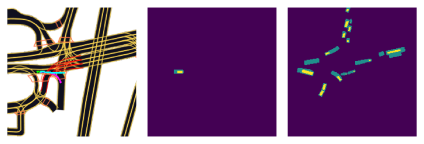
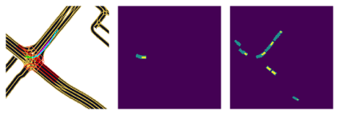
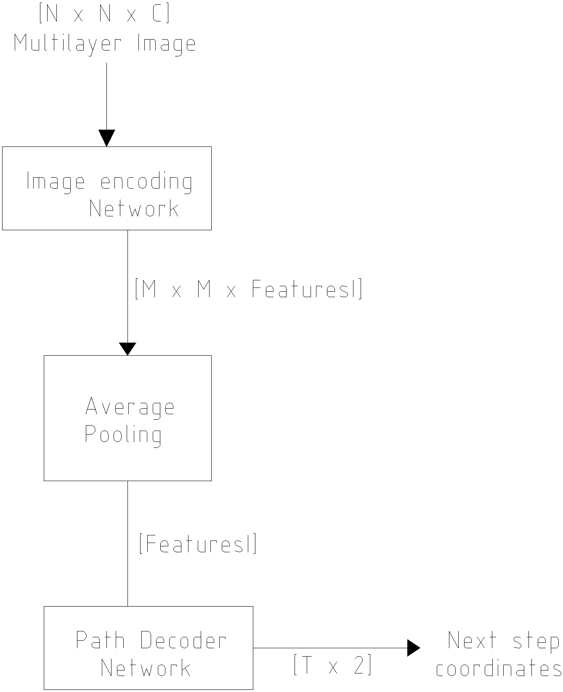
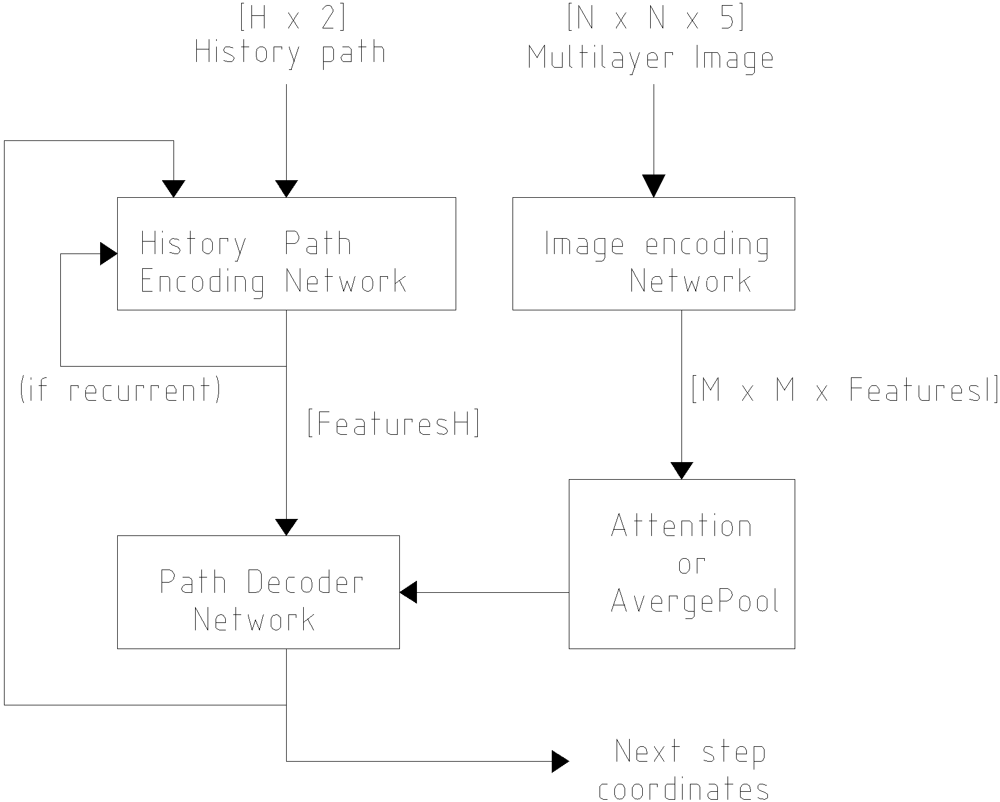
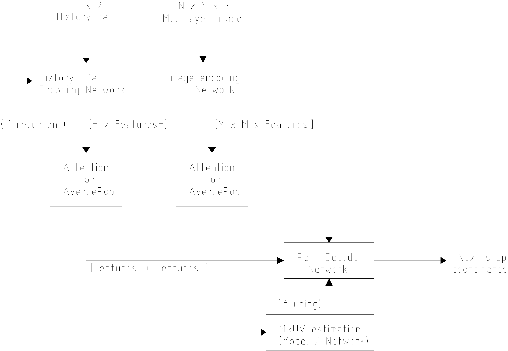

# Lyft Agent movement prediction using Recurrent Neural Networks and Attention 

This repository contains the models used by me in the [Lyft Kaggle competition](https://www.kaggle.com/c/lyft-motion-prediction-autonomous-vehicles). It is not a top-performer model, the score in the competition (likelihood) was ~190 (top 700). I ran out of training time...

 As opposed to most models of the competition I used RNNs and I tried to follow two papers from Sadeghian. I created the models from scratch, mostly for fun and to experiment with recurrent neural networks and attention. I learned many things about RNN training, like clipping gradients during the backward pass and not at the end, using stateful units anf apply visual and self attention.

The trained models used to reproduce my results are provided [here](https://mega.nz/file/LxlW1AbD#d1NIrplSP3fUcdVZ0GOEKNm1yGmnH-c7vSkE5GTDrBM). They should be decompressed in the root of the repository.

Many things are left to be done, such as more carefully selecting the training data, create a multiple path prediction model and not relaying too much on the history path. These things turned to be really important.

# Table of Contents
1. [Overview](#Overview)
2. [Code Description](#Code_Description)

# Overview

The competition required to estimate the future positions of a given agent (car, pedestrian or cyclist). The prediction had to extend 5 s into the future. The input information was an aerial map of the terrain, a semantic map, the position of the agent in the map, the position of other agents in the map and the history positions of the agents (around 10 s into the past). The expected use of this network is to estimate future positions of agents around an autonomous vehicle.

To train the models, Lyft provided a [big dataset](https://self-driving.lyft.com/level5/download/), a [nice library](https://github.com/lyft/l5kit) and [documentation](https://lyft.github.io/l5kit/). They are both required to run this code.

### Results

This library contains multiple models, however I only managed to train one (they require a lot of computation...). The tested model was the V2 model without attention (more information below). The inputs of the model havethe following shape:

The first image is the input semantic map, followed by the fade image of the Ego agent (the agent to be predicted) and the fade image of the other agents. In the semantic map the historical positions are marked in green (actually the network receives them as value data). The expected output of this sample is:

where the target path is shown in pink (?). The output of the network was the following (in cyan):

Some other examples:

ok:

under shot:

crashed (it forgot to turn):

ok (here it turned ok, because it was already turning):

### Base model

The base model is a model based on the Lyft baseline, it is composed of a convolutional network for feature extraction, an average pooling layer and a fully connected layer for predicting each next step. The network only predicts a fixed amount of future steps and ignores the history positions.

The input is an image of size NxN with 3 RGB channels from the semantic or aerial map, one channel for the current Ego position, one channel for the current agents positions and two additional channels for each history point, with the Ego and Agents positions. The input is fed to the *Image Encoding Network* (a pre-trained convolutional neural network), then its outputs are averaged and a feature tensor is obtained, which is fed to the *Path Decoder Network*, consisting of two fully connected layers. The output is a vector of coordinates with T time steps.

### Model V1

The model V1 is a free interpretation of two papers,  [sadeghian2018car](https://openaccess.thecvf.com/content_ECCV_2018/papers/Amir_Sadeghian_CAR-Net_Clairvoyant_Attentive_ECCV_2018_paper.pdf) and [sadeghian2019sophie](https://arxiv.org/abs/1806.01482). It works by applying a recurrent network to decode the future agent positions, based onf image and history features.

This model uses a *History Path Encoding Network* which encodes the path coordinates and creates a feature tensor. This network can be recurrent or not (if it is not recurrent the network is basically a CarNet). The graphical input is fed to the *Image Encoding Network*, a pre-trained convolutional neural network, which creates a feature map that can be processed by an attention layer (Bahdanau) or average pooled. Then this information is fed to the *Path Decoder Network*, a recurrent network that generates the next step coordinates. The generated coordinates are fed back to the network via the *History PAth Encoding Network*.
This network was a short test, I latter decided in favor of the V2 model, however it has the capability of imitate a CarNet.

### Model V2

The final model (and most succesfull of my tests) is the V2. It combines the concept of the SOPHIE net, with the possibility of using an external speed and acceleration estimation model (MRUV, from the spanish Movimiento Rectilineo Uniformemente Variado). 

The history input is processed by the *History Path Encoding Network*, a recurrent neural network that processes all the history path and generates tensor of features. The history features are processed by an attention mechanism (or average pooling) before being fed to the *Path Decoder Network*. It was expected that the hidden state of this network could be used to initialize the hidden state of the *Path Decoder Network*, however this is bugged in TensorFlow (when working in graph mode). 
The image input is processed by the *Image Encoding Network* just as in the model V1. The history and image features are concatenated and fed to the *Path Decoder Network*. The *Path Decoder Network* can also receive data from the *MRUV estimation model*, this block represents a neural network which analyses the feature tensor and tries to estimate the speed and acceleration of the agent. Then, at each predicted step, the *MRUV estimation model* feeds the *Path Decoder Network* the expected position of the agent if it where following a uniform linear path. The *MRUV estimation model* is trained along the path decoder network, using a simple speed and acceleration estimation based on the history path.

# Code_Description

### Requirements

The training of the model requires:
* CPU RAM >= 16 GB
* GPU RAM >= 12 GB (or more for the Base model)
* CUDA CAPABILITY > 3.6

The training times will largely depend on the CPU speed (GPU for the base model). A solid state storage unit is advised but not required.

The code can be run in an environment with python 3.6.8, jupyter notebook support and the following libraries:

* graphviz==0.14.2
* ipykernel==5.1.3
* ipython==7.11.1
* jupyter==1.0.0
* jupyter-core==4.6.1
* Keras-Applications==1.0.8
* Keras-Preprocessing==1.1.2
* l5kit==1.1.0
* matplotlib==3.1.2
* notebook==6.0.2
* numpy==1.18.1
* opencv-contrib-python-headless==4.4.0.44
* opt-einsum==3.1.0
* Pillow==7.2.0
* pydot==1.4.1
* PyYAML==5.3.1
* scipy==1.4.1
* tensorboard==2.3.0
* tensorflow-gpu==2.3.1
* torch==1.6.0
* torchvision==0.7.0
* tqdm==4.50.2
* zarr==2.5.0

### Training

To train the model execute the training notebook:
* *./AgentPrediction_Train.ipynb*

Using the selected configuration. Three examples are provided:

1. AgentPrediction_config_Baseline.yaml: The baseline of the Lyft competition, a convolutional network with fully connected layers as output (I never had the time to fully train it)

2. AgentPrediction_config_CarNet.yaml: An interpretation of the CarNet paper, [sadeghian2018car](https://openaccess.thecvf.com/content_ECCV_2018/papers/Amir_Sadeghian_CAR-Net_Clairvoyant_Attentive_ECCV_2018_paper.pdf)

3. AgentPrediction_config.yaml: The model V2 net, the one I used to generate my model.

The user can modify the training procedure in many ways:
* Select teacher force modulation across epochs.
* Modulate the learning rate.
* Modulate the number of future steps to train on.
* Select a minimum distance to train on (use only samples with at least X displacement).
* Code new stuff!

The training notebook will generate outputs per-epoch and also create a TensorBoard file.

At the end of the train notebook some plotting functions are provided.

### Testing

The testing of the model is done using the test notebook:

* *./AgentPrediction_Test.ipynb*

It has two main parts, first it generates a submission file for the Kaggle competition (no really useful now) and the second uses the validation dataset to generate a similar chopped dataset as the Test dataset and computes a validation score that is near the test score (sadly is the same data as the validation dataset, but the value is closer to that from the leader board).

To test the provided model set:

* path_load = './output_V2_noAttn_big_multiLoss_imgRetrain_mruvGuided_mruvModel'
* net_base_name = 'epoch_200'

